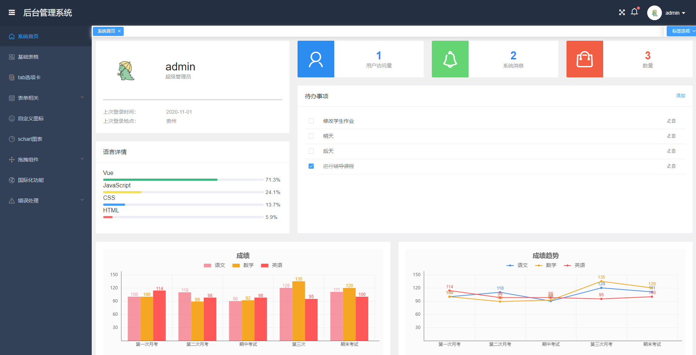
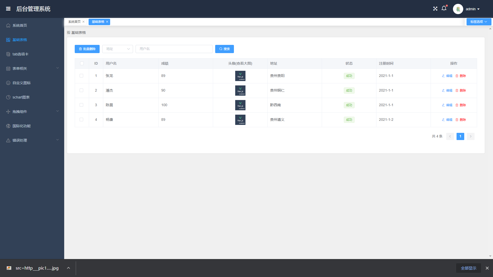

## 前言

该方案作为一套多功能的后台框架模板，适用于绝大部分的后台管理系统（Web Management System）开发。基于 vue.js，使用 vue-cli3 脚手架，引用 Element UI 组件库，

## 功能

-   [x] Element UI
-   [x] 登录/注销
-   [x] 仪表盘
-   [x] 表格
-   [x] Tab 选项卡
-   [x] 表单
-   [x] 图表 :bar_chart:
-   [x] 富文本编辑器
-   [x] markdown 编辑器
-   [x] 图片拖拽/裁剪上传
-   [x] 支持切换主题色 :sparkles:
-   [x] 列表拖拽排序
-   [x] 权限测试
-   [x] 404 / 403
-   [x] 三级菜单
-   [x] 自定义图标
### 效果展示

# vue-manage-system
